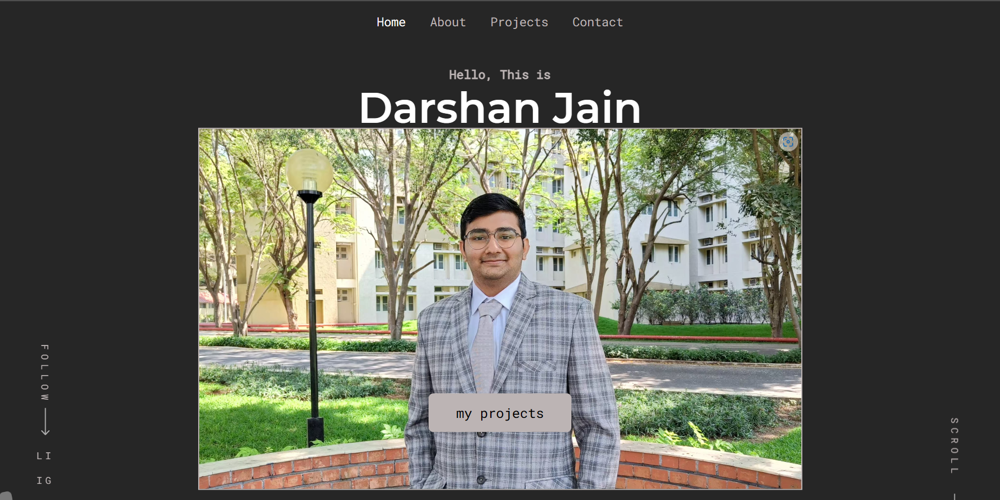

=======

# Hi, I'm Darshan Jain! 👋

## 🚀 About Me
A highly motivated
and
detail-oriented
computer science under-graduate in BTech,
possessing a keen interest in technology and
software development. Proficient in utilizing
programming languages such as Java, React, and
familiar with JavaScript,
MySQL,
and C++ .

Demonstrated ability to adapt quickly to new
environments and collaborate efficiently with
teams . Committed
to continuously expanding
expertise and staying current with the latest
advancements in technology.

# Darshan Jain Portfolio

## Author

- [@darshanjain](https://github.com/darshanjaipuria/)

## Screenshot

## Demo

For demo click on the below link

https://darshanjain.netlify.app/

## Appendix
To showcase my abilities , projects , experience with others.

## Project Details

A portfolio for a Fullstack Web Deveelper. Used React js to make this portfolio. A clean design with full responsiveness.Added smooth scroll in the portfolio which will make the scroll experience really elegant.

## Tech Stack

ReactJS
Javascript,
Styled Components,
HTML

## Dependencies

- React
- React Hooks
- Styled Components
- Swiper js
- React Transition Group
- Smooth Scrollbar
- React Icons
- React Router Dom
- More...

## 🔗 Links

## 🛠 Skills
Java, Javascript, HTML, CSS, ReactJS, MySql, ExpressJS, MongoDB
